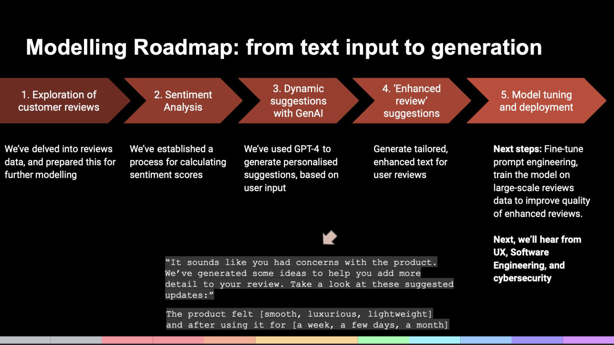
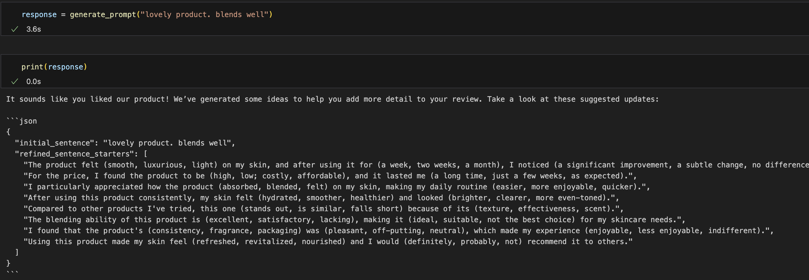

# Improving-Amazon-review-quality
Generating a text generation script as part of a 24-hour hackathon

## Problem Space
Amazon receives a vast volume of customer reviews, but the quality of these reviews often varies significantly. Customers frequently leave short, unhelpful reviews or exaggerated ratings that do not accurately reflect their experience with the product. This inconsistency in review quality impacts the overall trustworthiness and usefulness of reviews for potential buyers.

## Problem Statement
How might we support prospective reviewers in leaving higher-quality reviews to improve the overall quality and trustworthiness of Amazon reviews?

## Solution
We harnessed the power of Generative AI (GenAI) to create an enhanced review suggestion system. The system provides structured prompts and tailored suggestions to guide users in writing more detailed, helpful, and trustworthy reviews, ultimately improving review quality on Amazon.

## Data Science Opportunity
I led the data science GenAI model-building exploration for this project, focusing on developing a GenAI text generation script. This included:
- Designing the modeling roadmap.
- Generating high-quality text output for review suggestions based on input data.
- Implementing the solution in a time-efficient manner within the 24-hour hackathon constraints.



## Example Output
Here is an example of the output generated by my script, given an 'input' review from Amazon:


* We can see here that the AI-generated review offers potential synonyms/suggestions to build on the user's existing review.

The script showcases how GenAI can suggest more thoughtful and comprehensive product reviews.

## How to Set Up the Project

### 1. Clone the Repository
```bash
git clone https://github.com/nivi-prasad-1/Improving-Amazon-review-quality.git
cd Improving-Amazon-review-quality
```

### 2. Create and activate the environment
```bash

conda env create -f genai_review.yml
conda activate genai_review
```

### 3. Add your own API key and set as environment variable
```bash
export OPENAI_API_KEY=your_api_key_here

#The script will load the API key from this file automatically when you run it.
```

### 4. Start Jupyter Notebook by running the following command:
   ```bash
   jupyter notebook
   ```
### 5. Run the notebook located within 'Gen AI notebook'

## Acknowledgments
Special thanks to my hackathon team: fellow Data Scientist, UX designers, software engineers, and cybersecurity team members who contributed to the project, and developed a working prototype within the 24-hours.


